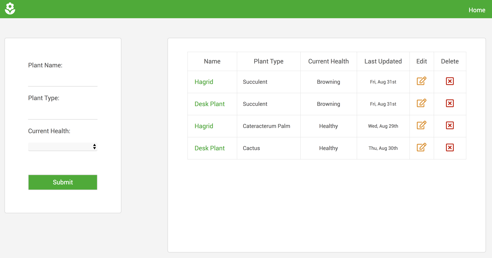

# Sprout Log

View a live demo [here](https://sprout-log.herokuapp.com/)!

## About The App

The intention behing SproutLog is to have a place where I can log in and update the current health of the plants in my home. The user can log in and see the last date a plant's health was updated and change the current status to Dying, Browning, Yellowing, and Healthy. This is so that the user can pay closer attention to the plant's health and then respond accordingly, whether that be changing watering frequency or sunlight exposure.

  
## API Documentation

The API for this application is a simple CRUD(Create, Read, Update, Delete) API and has routes set up for each of these actions in the server section of this repo and the front end makes asynchronous calls to these endpoints. Authentication is handled using [Passport](http://www.passportjs.org/) session authentication. 

## Technology Stack

The front end was built using HTML, CSS, and jQuery.

The back end was built using [Node](https://nodejs.org/en/), [Express](https://expressjs.com/), and authentication was handled using [Passport](http://www.passportjs.org/) session authentication. 

The database was built using [MongoDB](https://www.mongodb.com/) and [mlab](https://mlab.com/).

## References

  Landing page video – [Pexels](https://videos.pexels.com/)

  Flower Icon – [Google Material Design Icons](https://material.io/tools/icons/)

  Dashboard Icons – [Font Awesome Icons](https://fontawesome.com/)
